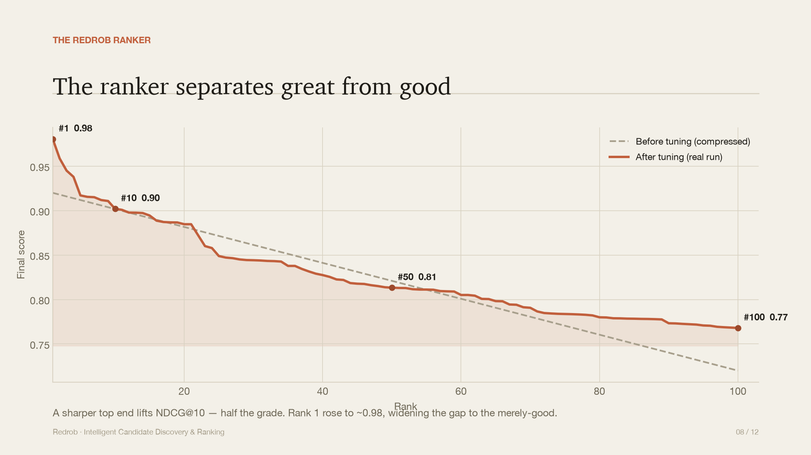
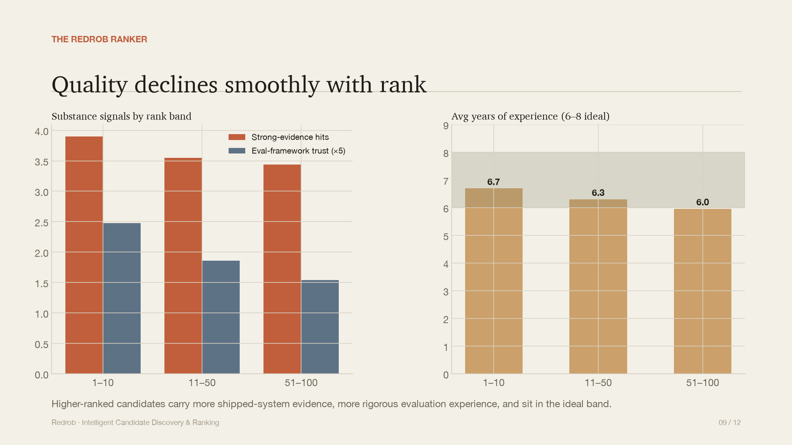
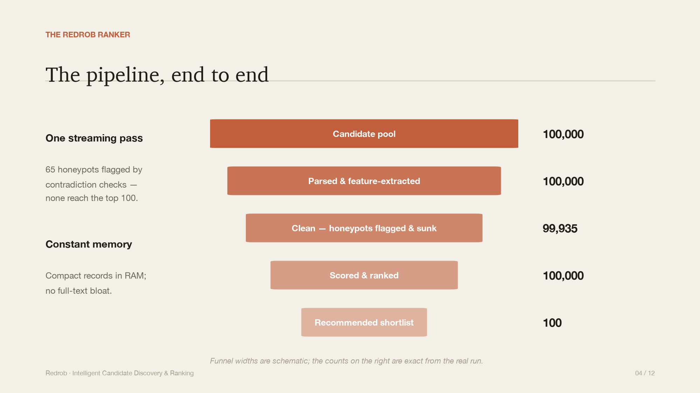
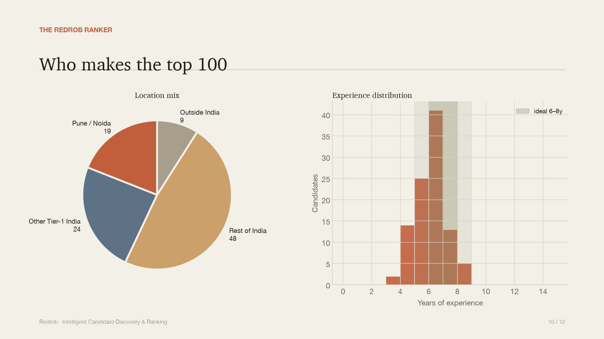

# Redrob Intelligent Candidate Ranker

Rank candidates for a job description the way a thoughtful recruiter would — by
understanding what the role *means*, not by counting keywords.

This system reads the released JD (Senior AI Engineer — Founding Team), scores
all 100,000 candidates in `candidates.jsonl`, and emits a spec-compliant
top-100 CSV. The **ranking step runs CPU-only, fully offline, in ~45 seconds**
on a laptop (peak RAM ~1.5 GB).

---

## TL;DR — reproduce the submission

```bash
python -m venv .venv && source .venv/bin/activate   # Windows: .venv\Scripts\activate
pip install -r requirements.txt

# STEP 1 (one-time, offline-after-download, ~4.3 min on CPU):
#   builds data/candidate_embeddings.npy + data/candidate_ids.json
python scripts/precompute_embeddings.py --candidates ./candidates.jsonl

# STEP 2 (the graded ranking step, ~45s, CPU-only, offline):
python rank.py --candidates ./candidates.jsonl --out ./submission.csv

# verify it passes the official validator
python validate_submission.py ./submission.csv      # -> "Submission is valid."
```

The pool ships gzipped — `candidates.jsonl.gz` is read directly (no manual
`gunzip` needed); pass it to either command.

**Don't want to precompute?** Run with the TF-IDF backend, which needs no
artifacts and builds its index inside the ~45s run:

```bash
python rank.py --candidates ./candidates.jsonl --out ./submission.csv --semantic-backend tfidf
```

`--semantic-backend auto` (default) uses the precomputed embeddings if present
and transparently falls back to TF-IDF otherwise.

> Place `candidates.jsonl[.gz]` at the repo root (or pass any path with
> `--candidates`). The bundled JD lives at `data/job_description.txt`; override
> with `--jd` if needed.

---

## Presentation deck & results at a glance

A self-contained approach deck (12 slides, all charts generated from the real
run) lives at **[`deck/redrob_approach_deck.pdf`](deck/redrob_approach_deck.pdf)**.
Rebuild it anytime:

```bash
python scripts/make_deck.py                               # uses cached data/deck_stats.json
python scripts/make_deck.py --candidates ./candidates.jsonl   # recompute pool aggregates
```

<table>
<tr>
<td></td>
<td></td>
</tr>
<tr>
<td></td>
<td></td>
</tr>
</table>

---

## The problem, and why keyword matching fails

The challenge is explicitly designed to punish keyword matching. The JD itself
warns about it:

- An **HR Manager who lists 9 "AI skills"** is *not* a fit, no matter how clean
  the skill list looks. (The provided `sample_submission.csv` deliberately falls
  for exactly this trap.)
- A candidate who never writes "RAG" or "Pinecone" but whose **career history
  shows they built a recommendation system at a product company** *is* a fit.
- ~80 **honeypots** have subtly impossible profiles (e.g. *8 years at a company
  that existed for 3*, or *"expert" in 10 skills with 0 months used*). The ground
  truth forces them to tier 0; ranking >10% of them in your top 100 is
  disqualifying.
- A perfect-on-paper candidate who **hasn't logged in for months** and ignores
  recruiters is, for hiring purposes, **not actually available** — down-weight.

So the system is built around *role fit and evidence*, with skills as one signal
among several — never the deciding one.

---

## How it works

A transparent, multi-signal pipeline. Every candidate gets a score in `[0, 1]`
that is fully decomposable, which keeps it explainable (Stage 4/5) and naturally
resistant to keyword stuffing.

```
                       (offline, one-time)
candidates.jsonl ─► precompute_embeddings.py ─► candidate_embeddings.npy

                       (ranking step, ~45s)
JD text ─► structured rubric (must-haves, anti-titles, disqualifiers, location)
                                   │
candidates.jsonl ─► stream ─► per-candidate feature extraction (single pass)
                                   │            │
                                   │            └─► plausibility / honeypot check
                                   ▼
        semantic similarity to JD  (precomputed embeddings · or TF-IDF fallback)
                                   ▼
   score = Σ wᵢ·componentᵢ  ×  disqualifier_mult  ×  availability_mult   (honeypots ×0.02)
                                   ▼
            deterministic ordering (score ↓, then candidate_id ↑)
                                   ▼
                top-100  +  grounded reasoning  ─►  submission.csv
```

### Scoring components (base score, weights sum to 1.0)

| Component | Weight | What it captures |
|---|---:|---|
| **Title fit** | 0.20 | On-target role (AI/ML/Search/NLP/Reco eng) vs anti-titles (HR/Marketing/Sales…). Generic eng titles (software/backend/data) are credited only in proportion to real AI signal; "Junior/Intern/Trainee" qualifiers are discounted (senior founding-team role); research-leaning titles are credited modestly. |
| **Skills fit** | 0.22 | *Trust-weighted* coverage of skill families. Trust = proficiency × duration-of-use × endorsements × **platform-verified assessment score**, so "expert, 0 months used" or a low verified score ≈ 0. Evaluation frameworks (NDCG/MRR/MAP) carry full must-have weight. |
| **Career evidence** | 0.22 | Free-text history mentions of retrieval/ranking/recommendation/production ML — the JD's #1 positive ("has shipped an end-to-end ranking/search/rec system") and the "hidden gem" signal. |
| **Semantic fit** | 0.14 | Cosine of the candidate document to the JD — **all-MiniLM-L6-v2 embeddings** (precomputed) or TF-IDF (fallback). |
| **Experience fit** | 0.12 | Proximity to the 5–9y band (ideal 6–8); drops steeply below ~5y so sub-band candidates don't outrank in-band ideal ones. |
| **Location fit** | 0.10 | Pune/Noida > Tier-1 India > India > outside India (no visa sponsorship). `willing_to_relocate` partially offsets the penalty for relocatable candidates. |

### Multiplicative modifiers (applied to the base score)

- **Disqualifiers** (the JD's "do NOT want" list): mostly-services/consulting
  career (detected by named firms *and* services industries), **research-leaning
  title with no production-deployment evidence** (the JD's explicit "pure
  research without production" exclusion), CV/speech/robotics without NLP/IR,
  framework-hype-only (LangChain with no deeper retrieval depth), frequent short
  stints (title-chasing). Soft penalties (floored at 0.30) — the JD says
  "probably not", not "never".
- **Availability** (clamped 0.40–1.05): recruiter response rate, recency of
  activity, open-to-work, notice period, plus two sub-factors surfaced
  separately in the score breakdown —
  - *market interest*: recruiter-saves and search-appearances in the last 30d,
    scored **relative to the pool's own median/p90** (not a hardcoded threshold);
  - *engagement/credibility*: profile completeness, interview-completion
    reliability, and GitHub activity (the JD values open-source builders).
- **Honeypots**: profiles failing plausibility checks are multiplied by 0.02,
  forcing them to the bottom. We catch ~65 of the ~80 with general impossibility
  rules and **zero false positives** — we never special-case IDs.

### Semantic backend: precomputed embeddings (default), TF-IDF (fallback)

The semantic component compares each candidate's document to the JD. We support
two interchangeable backends behind `--semantic-backend`:

- **`embeddings` (default via `auto`)** — `sentence-transformers/all-MiniLM-L6-v2`
  (~80 MB, 384-dim, CPU-friendly). Embeddings for the 100K pool are **precomputed
  once** (`scripts/precompute_embeddings.py`, ~13 min) and saved to
  `data/candidate_embeddings.npy`. At ranking time we load that matrix and embed
  **only the single JD string**, then take a cosine — a sub-second matrix-vector
  product. The model is cached locally after the first download, so both steps
  run **offline**. This captures semantic fit beyond lexical overlap (the
  "hidden gem" histories), which is the main NDCG lever.
- **`tfidf`** — word-bigram TF-IDF cosine, built inside the ranking run. Needs
  **no model weights, no network, no precomputed artifacts**, so the repo still
  runs end-to-end even where `sentence-transformers` can't be installed or the
  embeddings artifact is absent. `auto` falls back to this (with a printed
  notice) if the artifacts/model aren't available.

In an A/B on the full pool the two backends agree on 8/10 of the top-10 and
84/100 of the top-100, with the embeddings backend reordering the rest by
semantic understanding of the free-text histories.

---

## Reasoning quality

The `reasoning` column is generated **only from facts in the candidate's
profile** (current title, years, named skills that actually exist, real signal
values) and is tone-matched to the rank — strong picks read as strong, low picks
acknowledge gaps honestly. No invented skills, no templated name-insertion.

Example (rank 6, outside India):
> *Senior Machine Learning Engineer with 8.1 yrs, based in London; directly
> relevant experience for the embeddings/retrieval/ranking mandate; core skills
> include Elasticsearch, Hugging Face Transformers, Python; recruiter response
> rate 87%. Concern: located outside India (UK).*

---

## Repository layout

```
redrob-ranker/
├── rank.py                       # CLI entrypoint (the graded ranking step)
├── scripts/precompute_embeddings.py  # offline, one-time embedding precomputation
├── validate_submission.py        # official validator (copied from the bundle)
├── requirements.txt
├── submission_metadata.yaml      # portal metadata mirror
├── src/redrob_ranker/
│   ├── jd_spec.py                # structured understanding of the JD (the rubric)
│   ├── io_utils.py               # streaming JSONL/JSONL.gz reader + CSV writer
│   ├── features.py               # per-candidate feature extraction + text doc
│   ├── plausibility.py           # honeypot / internal-consistency detection
│   ├── retrieval.py              # TF-IDF semantic backend (fallback)
│   ├── retrieval_dense.py        # embeddings semantic backend (default)
│   ├── scoring.py                # multi-signal weighted scoring + modifiers
│   ├── reasoning.py              # grounded, varied reasoning generation
│   └── pipeline.py               # orchestration + backend selection
├── tests/test_pipeline.py        # sanity tests on the bundled sample
├── data/                         # JD text, schema, samples; embeddings artifacts (gitignored)
└── outputs/                      # generated submission.csv
```

## Compute profile (measured on 100K, Apple Silicon laptop, CPU-only)

| Step | Wall-clock | In 5-min budget? |
|---|---|---|
| Precompute embeddings (one-time) | **~4.3 min** (11s docs + ~245s embed) | ✅ yes (separate step) |
| Ranking — embeddings backend | **~43s** (parse ~34s · semantic ~8s · score <1s) | ✅ yes |
| Ranking — tfidf backend | **~46s** | ✅ yes |

Precompute is fast enough to also finish under 5 min: it embeds a **compact,
front-loaded document** (titles + skills + truncated summary) at a capped
sequence length (96 tokens) using all CPU cores. Verbose role descriptions are
omitted from the embedding (the career-evidence component already scans them in
full), which cuts embedding time ~3x with negligible ranking change (91/100
top-100 overlap vs. embedding the full document).

- Ranking-step peak RAM **~1.5 GB** (well under 16 GB); CPU-only; no network.
- Deterministic: same input → same output (stable tie-break by `candidate_id`).

## Tests

```bash
PYTHONPATH=src python -m pytest tests/ -q     # or: python tests/test_pipeline.py
```

Coverage includes: score range/monotonicity, on-target > off-target titles,
honeypots sinking, grounded/varied reasoning, **platform-verified assessment
discounting an inflated self-claim**, and the **github-zero ≠ missing** bug fix.

## Submission status — still required before upload

- ⚠️ **Hosted sandbox link NOT yet created** — the spec *requires* a working
  hosted demo (HuggingFace Spaces / Streamlit Cloud / Replit / Colab / Docker /
  Binder) that runs the ranker on a small sample. **This is a submission
  blocker.**
- ⚠️ **`submission_metadata.yaml` has TODO placeholders** — `team_name`,
  `primary_contact`, `team_members`, `github_repo`, `sandbox_link` still need
  real values.

## Limitations & future work

- **Recall is exhaustive, not ANN-indexed** — fine at 100K/45s, but a FAISS/HNSW
  ANN index over the precomputed embeddings plus a cross-encoder re-ranker on the
  top ~200 would likely lift NDCG@10 further.
- Honeypot detection is intentionally conservative (precision over recall); the
  broader role/evidence scoring keeps undetected honeypots out of the top anyway.
- Component weights are hand-set from reading the JD; with labeled data they
  could be tuned via learning-to-rank.
